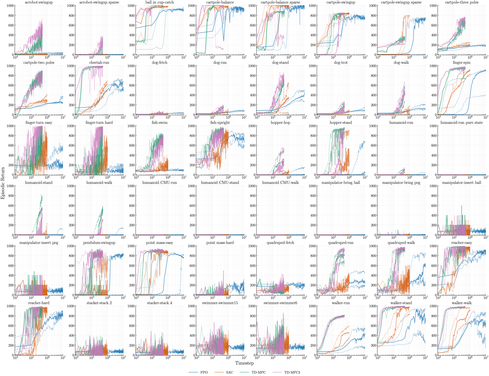

# Evaluating Performance Variation in Deep Reinforcement Learning



<!-- ABOUT THE PROJECT -->
## About The Project

This is an official code repository for the paper [Evaluating Performance Variation in Deep Reinforcement Learning]().
We provide a minimal codes to produce our proposed methods, which are
- Min-max normalized 90% interpercentile range (IPR-90): Quantitative measurement of performance variation in deep RL
- Run-wise percentile highlighting (RPH): Visualization method to capture performance variation over the learning curves.

We also provide the code we used to produce learning curves.

<!-- GETTING STARTED -->
## Getting Started

### Prerequisites

`Python 3.11` and `virtualenv` are required.

### Environment Setup

Build and activate the virtual environment by running the following command
```bash
virtualenv ./.venv
source ./.venv/bin/activate
```

Then, install all the dependencies as
```bash
pip install --upgrade pip
pip install -r requirements.txt
pip install -e .
```

Finally, download the Atari ROM with AutoROM:
```bash
AutoROM --accept-license --install-dir $.venv/lib/python3.11/site-packages/ale_py/roms/
```

### Download Data Used in Paper

If you wish to use the episodic return data in the paper, you can download from [public Google drive](https://drive.google.com/drive/folders/12i745DYa52hEvPAFuj2_A816gTTIyR9v?usp=drive_link).
The most convenient way to do this is by using `gdown`:
```bash
gdown --folder https://drive.google.com/drive/folders/12i745DYa52hEvPAFuj2_A816gTTIyR9v\?usp\=sharing
```

For the manual download, choose to download entire `data` folder.
After downloading the `zip` file, unzip it and move it to this project directory.

<!-- USAGE EXAMPLES -->
## Usage

### Producing Exemplar Min-max IPR-90 Bar Plot and RPH Learning Curves

Python function for Min-max IPR-90 and RPH are available in `notebooks/ipr.ipynb` and `notebooks/rph.ipynb`, respectively.
To run both jupyter notebooks, download the dataset by following the instruction above.
After downloading the dataset, run
```bash
jupyter lab . 
```

### Running Experiments

To run either PPO, SAC, DQN, or Rainbow, run following python command:
```bash
python main.py -c CONFIG_PATH --config_idx CONFIG_IDX --root_dir ROOT_DIR
```
`CONFIG_PATH` is a path to the configuration file (e.g., `./configs/ppo/default/light.toml`).
All the configuration files are stored in `configs` directory.
Note that configuration files are written in a way to encode multiple instance of experiment runs.
Because of this, from a file specified by `CONFIG_PATH`, `main.py` generates list of dictionaries where each contains configuration for single experiment run.
`CONFIG_IDX` specifies an index of this generated list, so is a specifier of which experiment to run.
`ROOT_DIR` specifies a path to directory for saving experiment results.

We used original code provided by the authors for TD-MPC and TD-MPC2 experiments.
To run these, follow the instructions of the original TD-MPC/TD-MPC2 codebases ([TD-MPC](https://github.com/nicklashansen/tdmpc) and [TD-MPC2](https://github.com/nicklashansen/tdmpc2)).

<!-- LICENSE -->
## License

[](https://creativecommons.org/licenses/by/4.0/)

This work is licensed under a [Creative Commons Attribution 4.0 International License](https://creativecommons.org/licenses/by/4.0/). See `LICENSE.txt` for more information.

<!-- CONTACT -->
## Contact

Haruto Tanaka - haruto@ualberta.ca


<!-- ACKNOWLEDGMENTS -->
## Acknowledgments

* [CleanRL](https://github.com/vwxyzjn/cleanrl)
* [dmc2gymnasium](https://github.com/imgeorgiev/dmc2gymnasium/tree/main)
* [Explorer](https://github.com/qlan3/Explorer)
* [TD-MPC](https://github.com/nicklashansen/tdmpc)
* [TD-MPC2](https://github.com/nicklashansen/tdmpc2)
